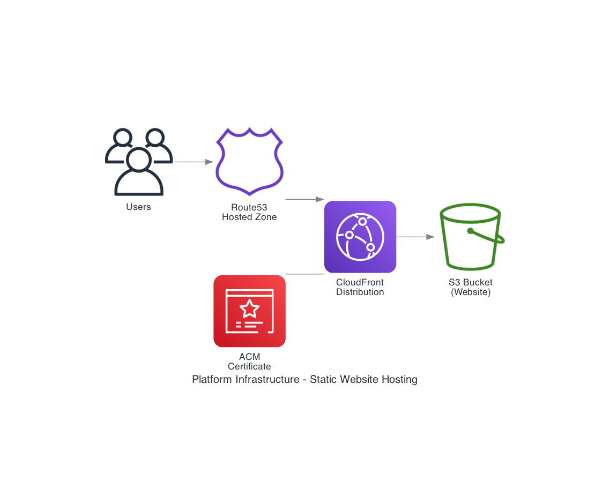

# Platform Infrastructure

AWS CDK infrastructure package for deploying static websites with CloudFront, S3, Route53, and ACM.

## Architecture



The infrastructure creates a fully managed static website hosting solution:

- **Route53 Hosted Zone**: DNS management for your custom domain
- **ACM Certificate**: SSL/TLS certificate for HTTPS (auto-validated via DNS)
- **CloudFront Distribution**: Global CDN with edge caching
- **S3 Bucket**: Origin storage for static website files
- **CloudFront Function**: Automatic `www` to apex domain redirect

## Features

- HTTPS-only access with automatic HTTP to HTTPS redirect
- Global edge caching via CloudFront (100+ edge locations)
- Automatic `www` subdomain redirect to apex domain
- Origin Access Identity for secure S3 access (no public bucket)
- Automatic S3 content deployment from `website/` folder
- Cost-optimized CloudFront price class (PRICE_CLASS_100)
- HTTP/2 and HTTP/3 support
- TLS 1.2 minimum security policy

## Prerequisites

- [Node.js](https://nodejs.org/) (v18 or later)
- [AWS CLI](https://aws.amazon.com/cli/) configured with credentials
- [AWS CDK CLI](https://docs.aws.amazon.com/cdk/latest/guide/cli.html) (`npm install -g aws-cdk`)
- AWS account with appropriate permissions
- A registered domain name

## Installation

### As a Dependency

```bash
npm install @prosoftsolutions/platform-infra
```

### Local Development

```bash
git clone https://github.com/prosoftsolutions/platform-infra.git
cd platform-infra
npm install
```

## Usage

### As an NPM Package

```typescript
import { PlatformStack, PlatformStackProps } from "@prosoftsolutions/platform-infra";
import * as cdk from "aws-cdk-lib";

const app = new cdk.App();

const props: PlatformStackProps = {
  project: "my-website",
  domain: "example.com",
  cdkBucketName: "my-cdk-assets-bucket",
  env: {
    account: process.env.CDK_DEFAULT_ACCOUNT,
    region: "us-east-1",
  },
};

new PlatformStack(app, "MyWebsiteStack", props);
```

### Using the BuildStack Helper

```typescript
import BuildStack from "@prosoftsolutions/platform-infra";

const app = BuildStack({
  project: "my-website",
  domain: "example.com",
  cdkBucketName: "my-cdk-assets-bucket",
  env: {
    account: "123456789012",
    region: "us-east-1",
  },
});

app.synth();
```

## Configuration

### PlatformStackProps

| Property | Type | Required | Description |
|----------|------|----------|-------------|
| `project` | string | Yes | Project name (used for resource naming and tagging) |
| `domain` | string | Yes | Apex domain name (e.g., `example.com`) |
| `cdkBucketName` | string | Yes | S3 bucket for CDK assets |
| `env` | object | No | AWS environment (account and region) |
| `tags` | object | No | Additional tags for all resources |

## Deployment

### 1. Prepare Website Content

Create a `website/` folder in your project root with your static files:

```
website/
├── index.html
├── error.html
├── css/
├── js/
└── images/
```

### 2. Bootstrap CDK (First Time Only)

```bash
cdk bootstrap aws://ACCOUNT_ID/us-east-1 
```

### 3. Deploy the Stack

```bash
npm run deploy
```

Or manually:

```bash
npm run build
cdk deploy
```

### 4. Configure Domain Name Servers (Manual Step)

After deployment, you must update your domain registrar's name servers to point to Route53.

The deployment outputs the required name servers:

```
Outputs:
Step1NameServers = ns-123.awsdns-45.org, ns-678.awsdns-90.com, ...
```

Update these at your domain registrar (GoDaddy, Namecheap, etc.).

### 5. Wait for DNS Propagation

DNS propagation can take up to 48 hours. The ACM certificate will auto-validate once DNS is properly configured.

## Stack Outputs

| Output | Description |
|--------|-------------|
| `Step1NameServers` | Route53 name servers (configure at registrar) |
| `Step2HostedZoneId` | Route53 Hosted Zone ID |
| `WebsiteURL` | Primary website URL (`https://example.com`) |
| `WwwWebsiteURL` | WWW URL (redirects to apex) |
| `CloudFrontDistributionId` | Distribution ID (for cache invalidation) |
| `CloudFrontDomainName` | CloudFront domain (works immediately) |
| `S3BucketName` | S3 bucket name for manual uploads |

## Updating Website Content

### Via Redeployment

Update files in `website/` and redeploy:

```bash
npm run deploy
```

### Via AWS CLI

```bash
aws s3 sync ./website s3://BUCKET_NAME --profile pss
aws cloudfront create-invalidation --distribution-id DISTRIBUTION_ID --paths "/*" --profile pss
```

## Cache Invalidation

To force CloudFront to fetch fresh content:

```bash
aws cloudfront create-invalidation \
  --distribution-id YOUR_DISTRIBUTION_ID \
  --paths "/*" \
  --profile pss
```

## Troubleshooting

### Certificate Stuck in "Pending Validation"

- Ensure name servers are correctly configured at your registrar
- Wait for DNS propagation (can take up to 48 hours)
- Verify with: `dig NS yourdomain.com`

### Website Not Loading

1. Check CloudFront domain first (works without DNS): `https://dxxxxxxxxx.cloudfront.net`
2. Verify DNS resolution: `dig yourdomain.com`
3. Check S3 bucket has content: `aws s3 ls s3://BUCKET_NAME --profile pss`

### 403 Forbidden Errors

- Ensure `index.html` exists in the S3 bucket
- Check CloudFront Origin Access Identity permissions
- Verify S3 bucket policy allows CloudFront access

## Project Structure

```
platform-infra/
├── src/
│   ├── index.ts          # Main entry point and BuildStack helper
│   ├── platform-stack.ts # CDK Stack definition
│   └── types.ts          # TypeScript interfaces
├── website/              # Static website content (create this)
├── dist/                 # Compiled output
├── cdk.json              # CDK configuration
├── package.json
└── tsconfig.json
```

## Cost Considerations

Estimated monthly costs (us-east-1, low traffic):

| Service | Estimated Cost |
|---------|----------------|
| Route53 Hosted Zone | $0.50/month |
| CloudFront | Pay per request + data transfer |
| S3 | Pay per GB stored + requests |
| ACM Certificate | Free |

For low-traffic sites, expect $1-5/month. High-traffic sites will vary based on data transfer.

## License

ISC

## Author

ProSoft Solutions
